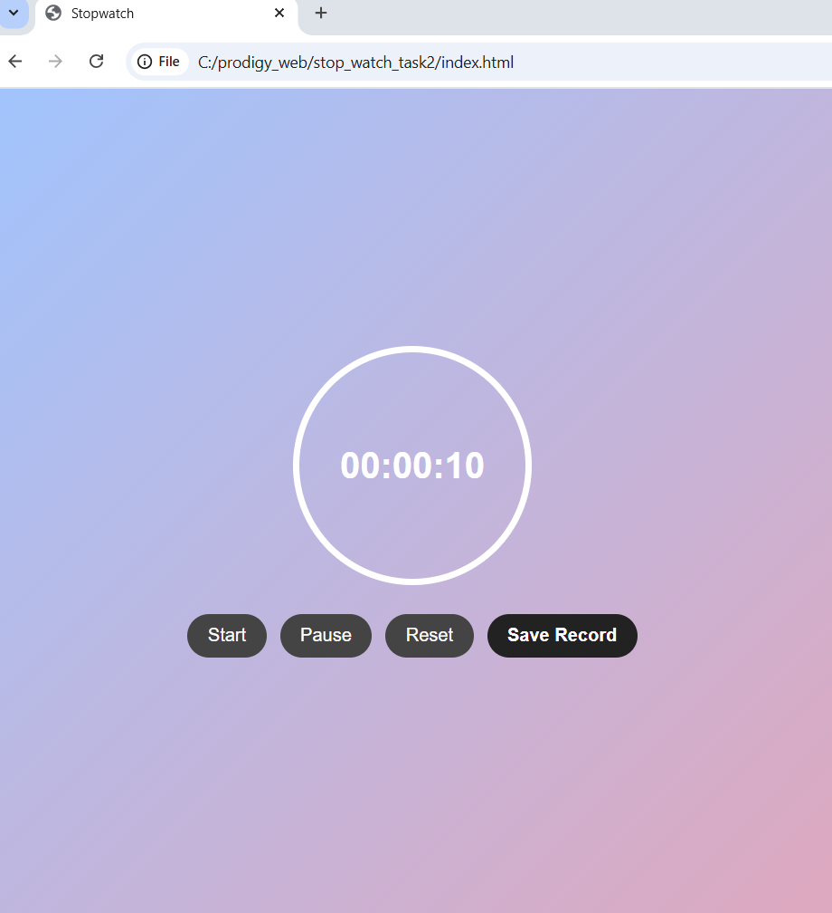
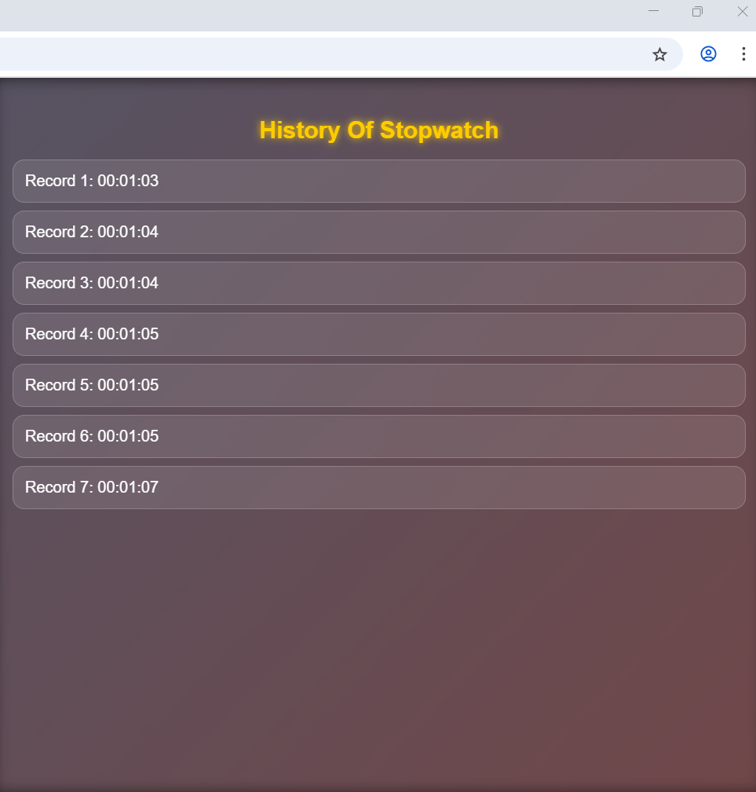
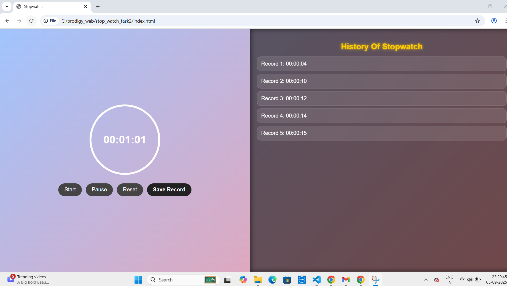

# ⏱️ PRODIGY_WD_02 – Stopwatch Web Application

👉 “A fully functional stopwatch web app built using HTML, CSS, and JavaScript with Start, Pause, Reset, and Lap tracking features.”

---

## 📌 Project Description
This project is my **Task-02** for the Web Development Internship at **Prodigy InfoTech**.  
I created a **Stopwatch Web Application** that helps users track time intervals accurately with simple and interactive controls.

---

## 🎨 Features
- ⏱️ **Start, Pause, Reset** stopwatch functionality  
- 📝 **Lap Recording** – Save and view lap times  
- 🎨 **Modern UI** with gradient background and circular display  
- 🖱️ **Interactive Buttons** with hover effects  
- 📑 **Lap History Panel** – Glassmorphism style with glow effects  
- 📱 **Responsive Design** for all screen sizes  

---

## 📂 Project Structure
PRODIGY_WD_02/

│── index.html 
│── style.css 
│── script.js 
│── stopwatch.png 
│── record.png 
│── indexpage.png 
└── README.md 

## 🖼️ Screenshots
### Stopwatch UI  
  

### Lap Records  
  

### Home Page View  
  
